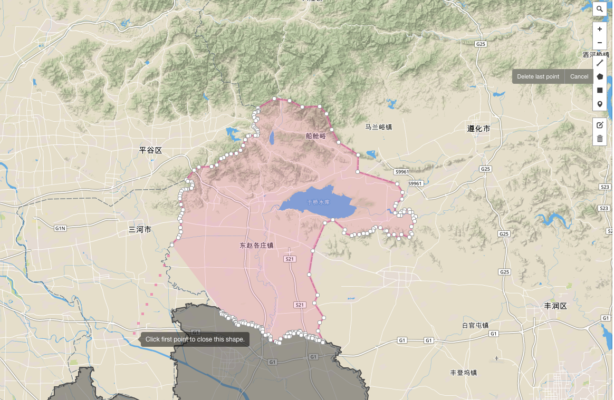
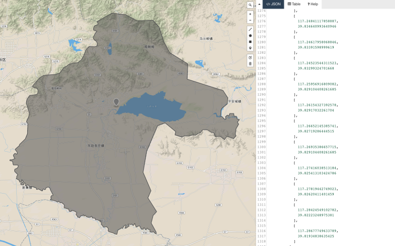

# Create new geo shape and append it

Take Tianjin city as an example. [Jizhou district](https://baike.baidu.com/item/蓟州区)
was merged into Tianjin city in June, 2016. Hence, echarts-maps needs to update Tianjin
map.

## Tutorial

1. Please download [Tianjin map](https://raw.githubusercontent.com/echarts-maps/echarts-china-cities-js/2f9a518febbd59868f648ce08901d6993d6c0ba1/geojson/shape-with-internal-borders/tianjin.geojson) and save as: `tianjin.geojson`
1. Open geojson.io in your browser. Drag and drop `tianjin.geojson` into it:

    

1. Draw Jizhou district using Polygon tool:

    Please remember that to close the polygon, you need to click the first point
    

1. After the polygon is complete, the helping shapes disappears but the polygon. Please save the right hand side geojson as：jizhouqu.geojson

    

1. It is time to use echarts-mapmaker.

    ```
    $ npm install -g echarts-mapmaker
    $ merge tianjin.geojson jizhouqu.geojson
    $ ls merged_tianjin.geojson
    ```

1. `merged_tianjin.geojson` is then the final geojson

    

## Make a js file

This needs [echarts-mapmaker](../tools/mapmaker.md).

```
$ makejs tianjin.geojson tianjin.js 天津
```

Please note that the last name is a map registry name so you will need to use the
same name inside echarts.
