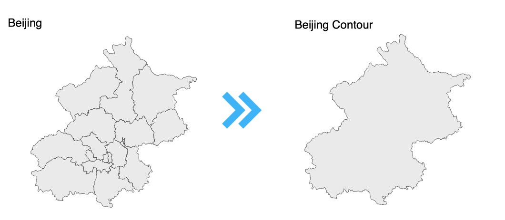

# Make a contour of Beijing city map



Now, let's have a hands-on session to transform [Beijing city map with internal borders](https://github.com/echarts-maps/echarts-china-cities-js/blob/master/geojson/shape-with-internal-borders/beijing.geojson) into a contour of Beijing：

1. Please install: node.js. And I recommend that everyone use [nvm](https://github.com/nvm-sh/nvm), the advantage is switching between node.js versions could not be easier.
1. Install  mapshaper，echarts-mapmaker

    ```npm install -g mapshaper echarts-mapmaker```

1. Download [Beijing city map with internal borders](https://raw.githubusercontent.com/echarts-maps/echarts-china-cities-js/master/geojson/shape-with-internal-borders/beijing.geojson)
1. Use mapshaper

    ```mapshaper beijing.geojson  -dissolve2 -o beijing-shape-only.geojson```

1. Open beijing-shape-only.geojson in geojson.io.