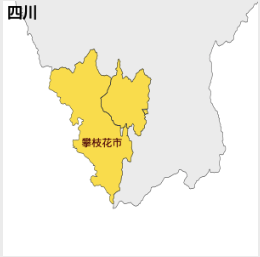
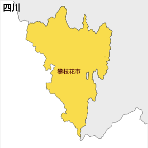

# How to remove an internal border in Pan Zhi Hua city

The problem definition：

The map after fix：

In an overview, let's single out Pan Zhi Hua city from Si Chuan province map, dissolve its internal borader and put it back

Details：

1. Run mapmaker's `split` command, and split up `echarts/map/json/province/sichuan.json`.
2. Then `decompress 攀枝花市.geojson d_pan.geojson`
3. Dissolve internal borders: `mapshaper d_pan.geojson  -dissolve2 -o d_pan_shape_only.geojson`
4. Please note, `d_pan_shape_only.geojson` cannot be used by `echarts`
5. Please `mapmaker` command： `shaper2echarts d_pan_shape_only.geojson d_pan_shape_only_echarts.geojson 攀枝花市`, so that `d_pan_shape_only_echarts.geojson` can be used with echarts.
6. Before the geojson is inserted back, we'd better UTF8-ecode it: `compress d_pan_shape_only_echarts.geojson utf_encoded_pan_shape_only.geojson`
7. Now let's put it back: `merge echarts/map/json/province/sichuan.json utf_encoded_pan_shape_only.geojson`
8. Voila, here is the final geojson file: `merged_sichuan.json`
9. If you want a javascript file, you need to run one more command： `makejs merged_sichuan.json sichuan.js 四川`