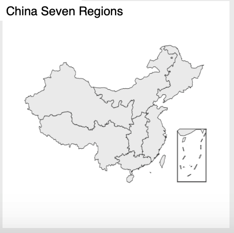
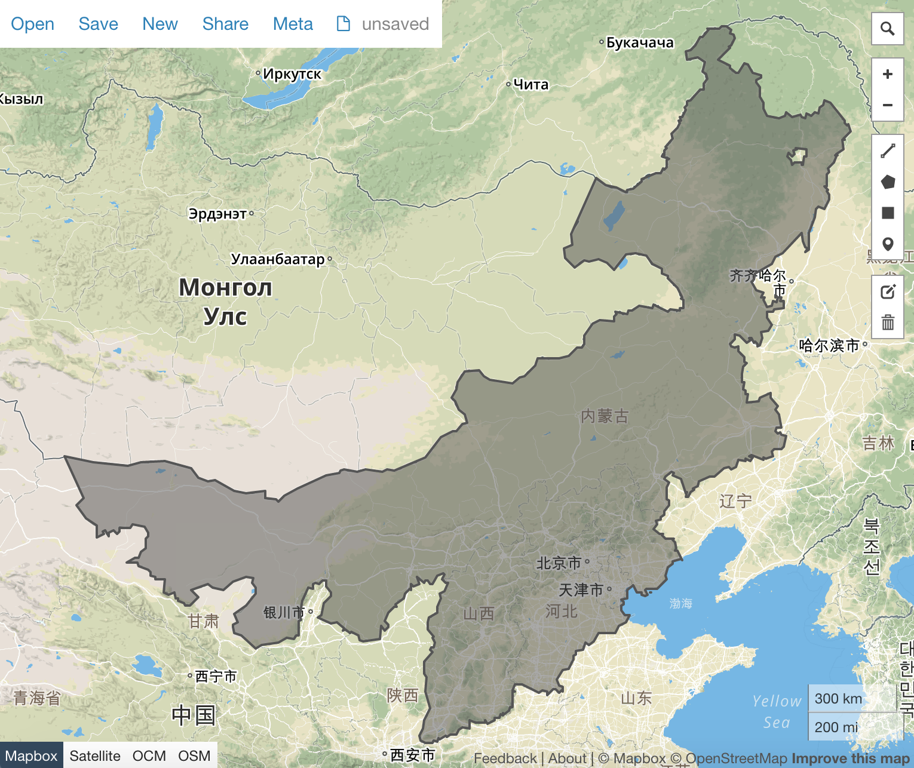

# Make northern China map

## Introduction

Do you want to know how [seven regions of China](https://echarts-maps.github.io/echarts-china-misc-js/preview.html) is authored? This section will reveal the techinical details.
It is not that difficult at all.



## Theory

All we need is [echarts-mapmaker](../tools/mapmaker) and echarts' map resource.

`echarts:map/json/china.json` provides a China map with individual provinces and
regions. In this section, we are going to learn how we separate the features,
and stiches the chosen shapes together.

## Tutorial

1. git clone https://github.com/apache/incubator-echarts。Please do not download the actual file.
1. copy incubator-echarts/map/json/china.json to your current working directory
1. use echarts-mapmaker' split command to split `china.json`, so as to get individual provinces and regions.

    ```
    $ split china.json
    $ ls
    china.json  		吉林.geojson		山东.geojson		江苏.geojson		海南.geojson		福建.geojson		陕西.geojson
    上海.geojson		四川.geojson		山西.geojson		江西.geojson		湖北.geojson		西藏.geojson		青海.geojson
    云南.geojson		天津.geojson		广东.geojson		河北.geojson		湖南.geojson		贵州.geojson		香港.geojson
    北京.geojson		宁夏.geojson		广西.geojson		河南.geojson		澳门.geojson		辽宁.geojson		内蒙古.geojson
    台湾.geojson		安徽.geojson		新疆.geojson		浙江.geojson		甘肃.geojson		重庆.geojson		黑龙江.geojson
    ```

    Voila, it is done!

1. Merge! What the provinces for northen China: Hebei, Inner Mongolia, Shanxi, Beijing and Tianjin.

    ```
    $ merge 河北.geojson 内蒙古.geojson 
    $ merge merged_河北.geojson 山西.geojson 
    $ merge merged_merged_河北.geojson 北京.geojson 
    $ merge merged_merged_merged_河北.geojson 天津.geojson 
    $ mv merged_merged_merged_merged_河北.geojson 华北.geojson
    ```

    怎么会有这么多 'merged_' ？`merge` 工具自动加一个前缀，运行多次，就有这么多了。有改进意见的话，可以告诉我。

1. Let's preview our map.

    Please note the merged map has been UTF8 encoded. In order to use geojson.io to preview it, we need to decode it first

    ```
    decode 华北.geojson huabei.geojson
    ```

    Then drag and drop it into [geojson.io](http://geojson.io):


    


## Make a contour

1. Please remember that we need to decode the merged geojson file. 
1. mapshaper could help us in getting rid of its borders:

    ```
    mapshaper huabei.geojson -dissolve2 -o huabei-shape-only.geojson
    ```
1. Let's view the result

    

## Home work

1. Take [this reference](add-ji-zhou-qu-to-tianjin.md), make a js version.
1. Make a central China map
1. Make a China map with seven regions.