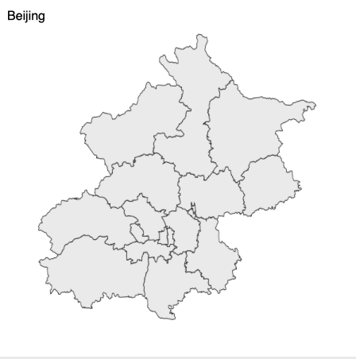
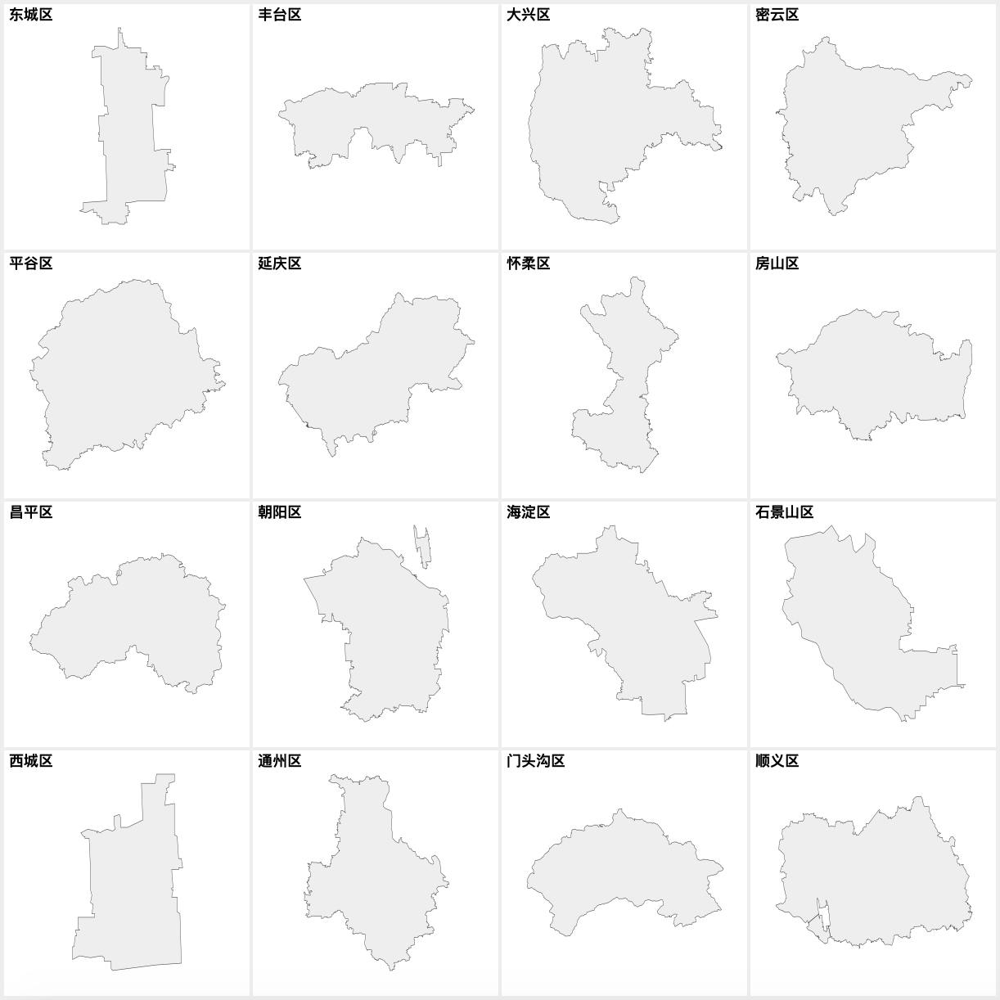
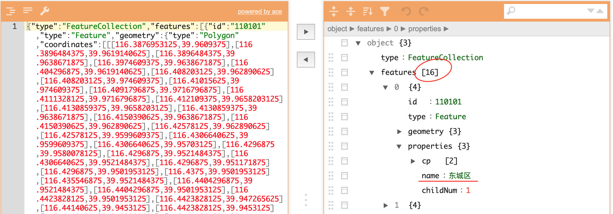
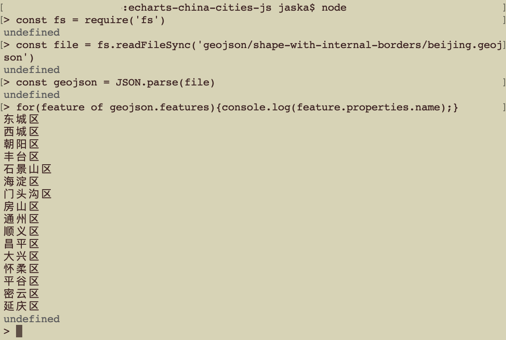

# Where do the county maps come from?

Simply, they are splited from [city maps](https://echarts-maps.github.io/echarts-china-cities-js/).
Take Bejing as an example, its own map



could be splitted into the following independent shapes:




## Theory

geojson is a json file and can be edited by any json editor.
Let drop Beijing geojson file into [json editor online](https://jsoneditoronline.org).



You will find that it consists of 16 geojson features. The first one is called “东城区”

If you have node, we can have a programmatic inspection:




## One step operation

Now let use echarts-mapmaker's split:


```
$ split geojson/shape-with-internal-borders/beijing.json
$ ls
东城区.geojson		怀柔区.geojson		通州区.geojson
丰台区.geojson		房山区.geojson		顺义区.geojson
大兴区.geojson		昌平区.geojson		石景山区.geojson
密云区.geojson		朝阳区.geojson		门头沟区.geojson
平谷区.geojson		海淀区.geojson
延庆区.geojson		西城区.geojson
```

## Conclusion

[2882 counties, islands and districts](https://echarts-maps.github.io/echarts-china-counties-js/pages/index.html) were done in this way.