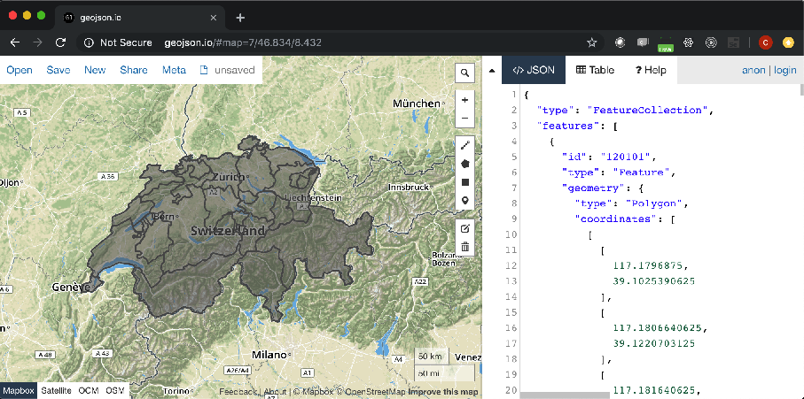

# Source Switzerland from natural earth data

## What is natural earth data?

## How to source Switzerland from natural earth data?

Before we start, please get [GDAL](../tools/gdal.md) installed

1. Download [图包](https://www.naturalearthdata.com/http//www.naturalearthdata.com/download/10m/cultural/ne_10m_admin_1_states_provinces.zip). On [this page](https://www.naturalearthdata.com/downloads/10m-cultural-vectors/)，Choose “Admin 1 - States, Provinces“ 。

    Why? Admin 1 shows internal borders of each state or province. You can choose
    "Admin 0 - Boundary lines"

1. Unzip it.

1. Now please use `og2ogr` to get switzerland geojson out:

    ```
    ogr2ogr -f GeoJSON -where "ADM0_A3 in ('CHE')" switzerland.geojson ne_10m_admin_1_states_provinces.shp
    ```

1. Now we can open it inside geojson.io:

    

## To get Switzerland displayed using echarts, what are the additional steps?

1. natural earth data provides quote a few localized place names. But so far,
only one language is supported.


    ```
    { "type": "Feature", "properties": { "featurecla": "Admin-1 scale rank", "scalerank": 9, "adm1_code": "CHE-168", "diss_me": 168, "iso_3166_2": "CH-TI", "wikipedia": null, "iso_a2":
"CH", "adm0_sr": 1, "name": "Ticino", "name_alt": "Tesino|Tessin", "name_local": null, "type": "Canton|Kanton|Chantun", "type_en": "Canton", "code_local": null, "code_hasc": "CH.TI"
, "note": null, "hasc_maybe": null, "region": null, "region_cod": null, "provnum_ne": 15, "gadm_level": 1, "check_me": 20, "datarank": 7, "abbrev": null, "postal": "TI", "area_sqkm"
: 0, "sameascity": -99, "labelrank": 9, "name_len": 6, "mapcolor9": 7, "mapcolor13": 3, "fips": "SZ20", "fips_alt": null, "woe_id": 2347102, "woe_label": "Canton of Ticino, CH, Swit
zerland", "woe_name": "Ticino", "latitude": 46.3604, "longitude": 8.79019, "sov_a3": "CHE", "adm0_a3": "CHE", "adm0_label": 2, "admin": "Switzerland", "geonunit": "Switzerland", "gu
_a3": "CHE", "gn_id": 2658370, "gn_name": "Cantone Ticino", "gns_id": -2554455, "gns_name": "Ticino, Cantone", "gn_level": 1, "gn_region": null, "gn_a1_code": "CH.TI", "region_sub": null, "sub_code": null, "gns_level": 1, "gns_lang": "swa", "gns_adm1": "SZ20", "gns_region": null, "min_label": 8.7, "max_label": 11.0, "min_zoom": 8.7, "wikidataid": "Q12724", "name_ar": "كانتون تيسينو", "name_bn": "তিকিনো", "name_de": "Kanton Tessin", "name_en": "Ticino", "name_es": "Tesino", "name_fr": "canton du Tessin", "name_el": "Τιτσίνο", "name_hi": "तिचीनो कैन्टन", "name_hu": "Ticino kanton", "name_id": "Kanton Ticino", "name_it": "canton Ticino", "name_ja": "ティチーノ州", "name_ko": "티치노 주", "name_nl": "Ticino", "name_pl":"Ticino", "name_pt": "Ticino", "name_ru": "Тичино", "name_sv": "Ticino", "name_tr": "Ticino", "name_vi": "Ticino", "name_zh": "提契諾州", "ne_id": 1159307671 }, "geometry": {...
    ```

1. So you can choose a property name to be `name` using echarts-mapmaker' property command:

    ```
    property -r name_en,name switzerland.geojson  
    ```

1. Let [open](https://github.com/echarts-maps/echarts-countries-js/blob/master/geojson/shape-with-internal-borders/switzerland.geojson) it again, it now has an English name:

    

## Reference

[Let's make a map](https://bost.ocks.org/mike/map/)