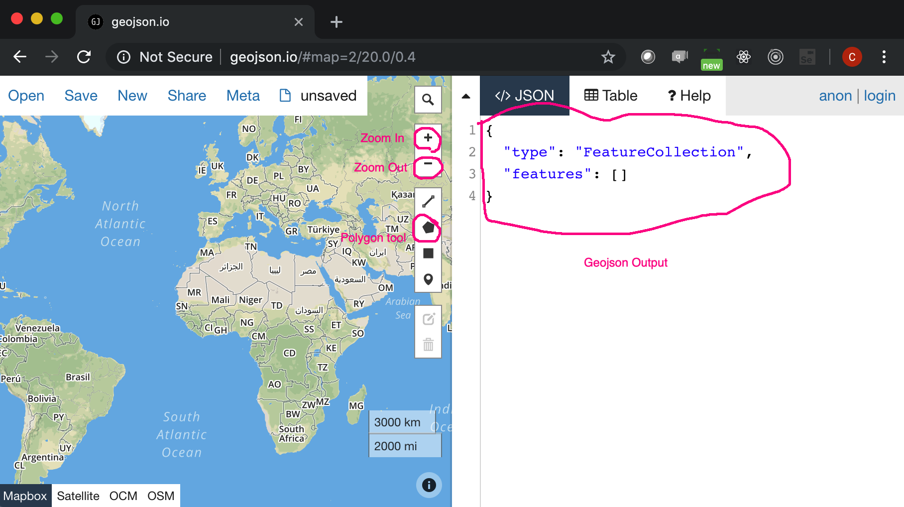
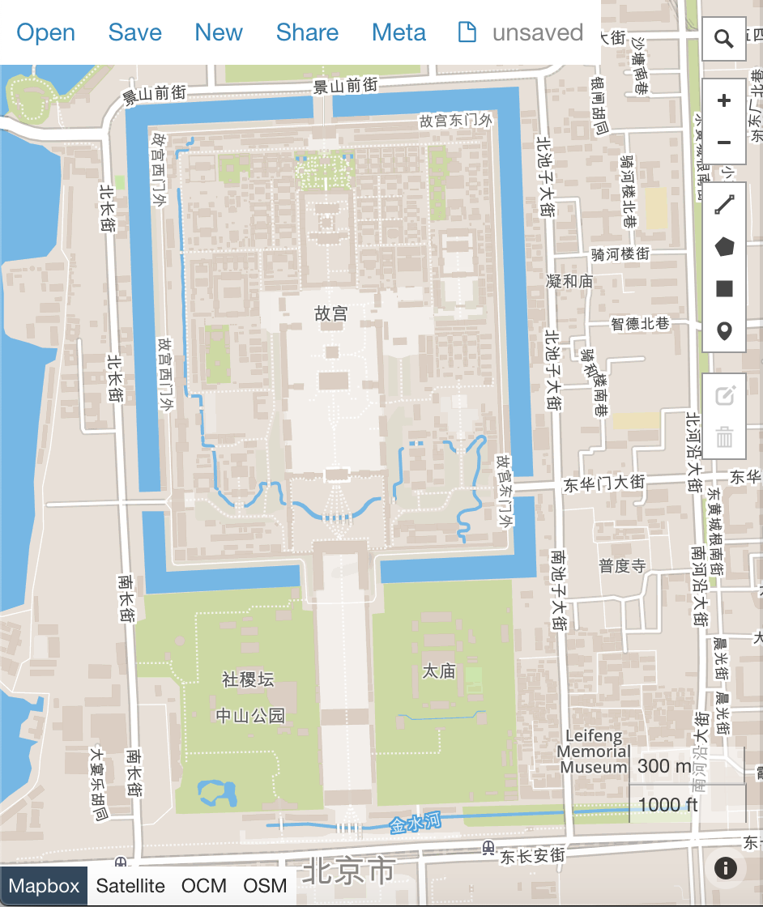

# How to use geojson.io to draw custom polygons

## Draw your first polygon: the Forbidden City in Beijing

1. Open [geojson.io](http://geojson.io) in Chrome

    

1. Centre the map on Beijing and zoom out

    

1. Click on polygon tool and start drawing

    

1. Remember to finish a polygon, you must click the first point which you started from.

    

1. Highlight the text area on the right. Select all and copy (Ctrl + A, then Ctrl + C).
Open a new file and paste the copied geojson content in it, save!
1. Open [geojson.io](http://geojson.io) in another window。Drag and drop the new file
into it. You should see the Forbidden City polygon.