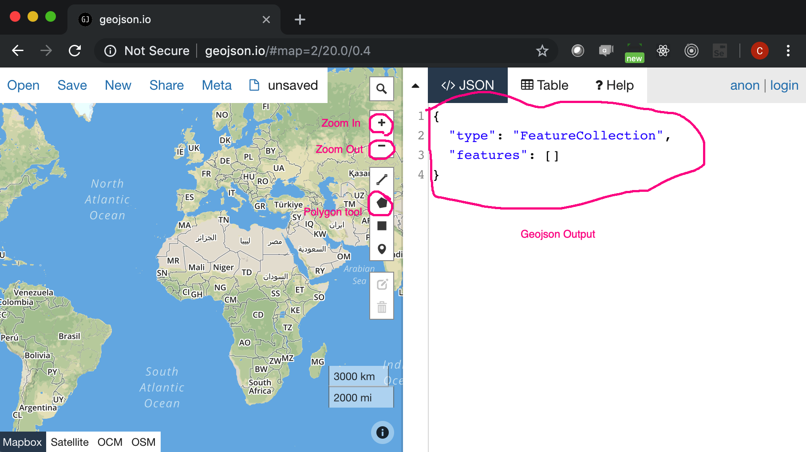
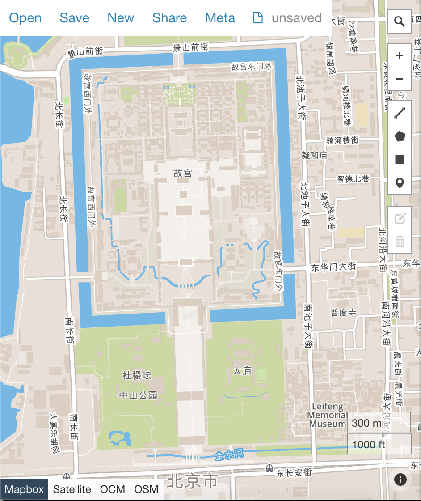
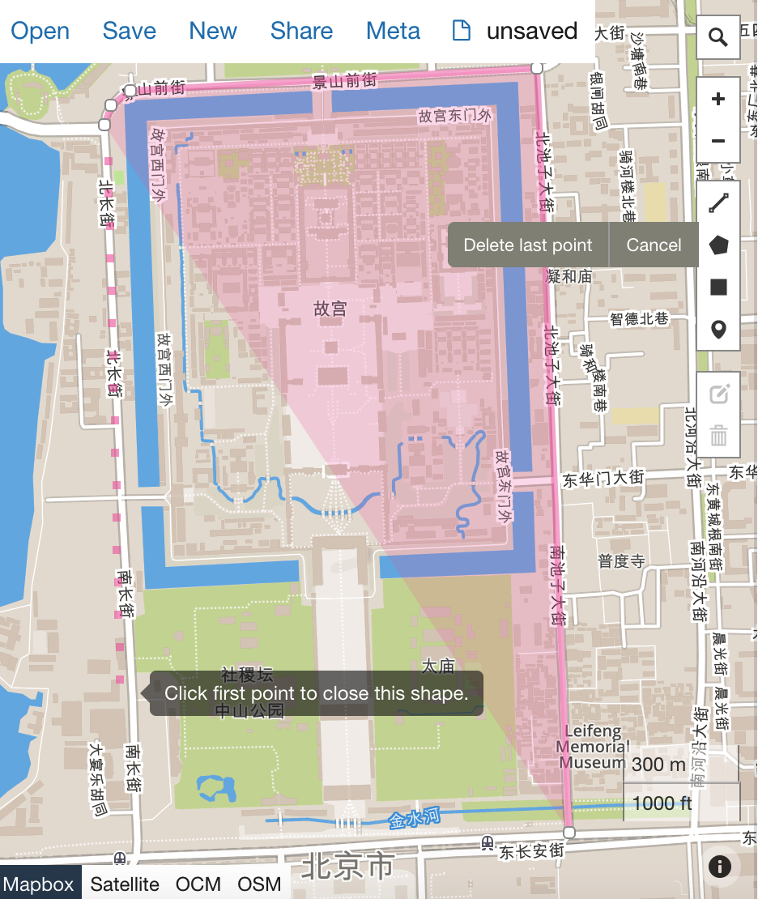
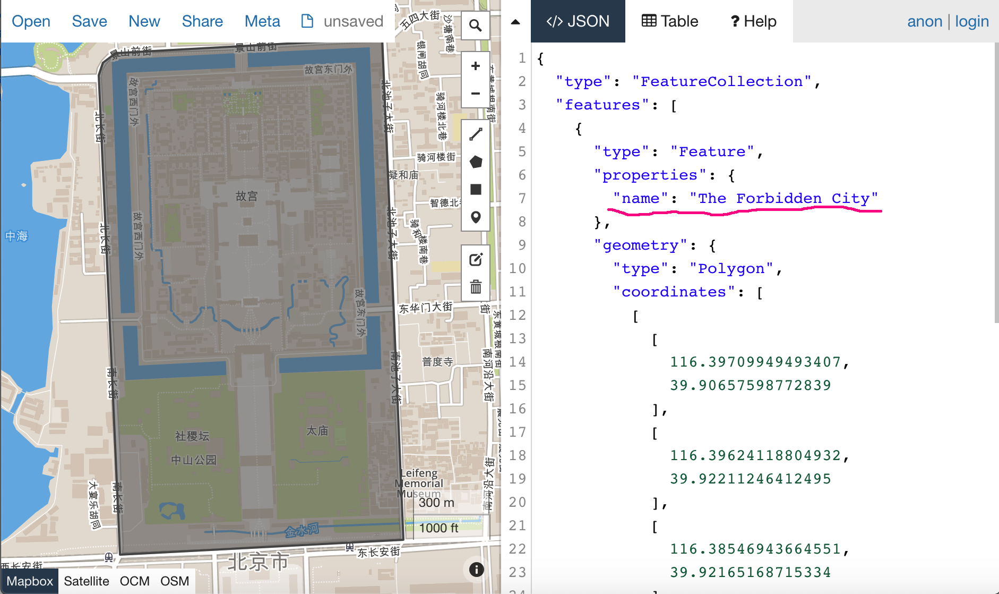

# How to create a custom geojson shape and get it displayed with pyecharts

The source files of this tutorial is on [github](https://github.com/echarts-maps/The-Forbidden-City-Demo)

## Draw your first polygon: the Forbidden City in Beijing

1. Open [geojson.io](http://geojson.io) in Chrome

    

1. Centre the map on Beijing and zoom out

    

1. Click on polygon tool and start drawing

    

1. Remember to finish a polygon, you must click the first point which you started from.

    

1. Highlight the text area on the right. Please insert one key value pair as underlined:

   ```"name": "The Forbidden City"

1. Then save the geojson into a local file, for example "The-Forbidden-City.geojson"


## Preview geojson

Open [geojson.io](http://geojson.io) in another window. Drag and drop the new file
into it. You should see the Forbidden City polygon.


## Coming up

We are going to integrate it with pyecharts