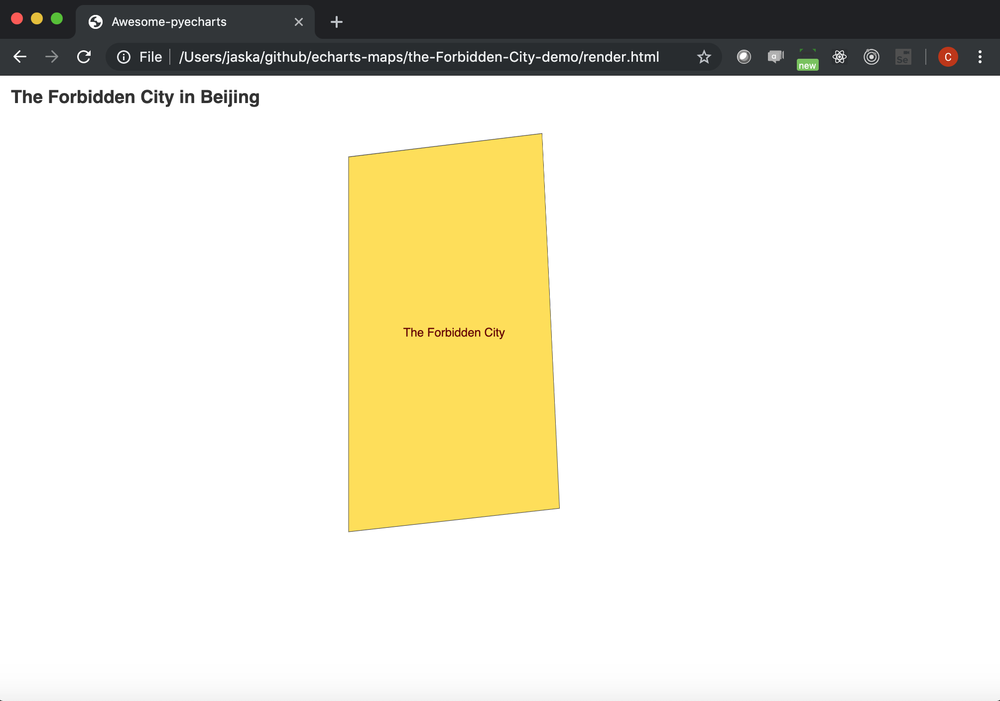

# Get it displayed in pyecharts

## 1. Pyecharts rendering code

```python
from pyecharts import options as opts
from pyecharts.charts import Geo
from pyecharts.datasets import register_url

register_url("http://127.0.0.1:8000")

g = (
       Geo()
        .add_schema(maptype="The Forbidden City")
        .set_global_opts(
            title_opts=opts.TitleOpts(title="The Forbidden City in Beijing"),
        )
)
g.render()

```

## 2. Please save above code as "The-Forbidden-City.py" and run it:

```
$ python The-Forbidden-City.py
$ ls
render.html ...
```

## 3. Please open it with your browser and you shall find it as:



