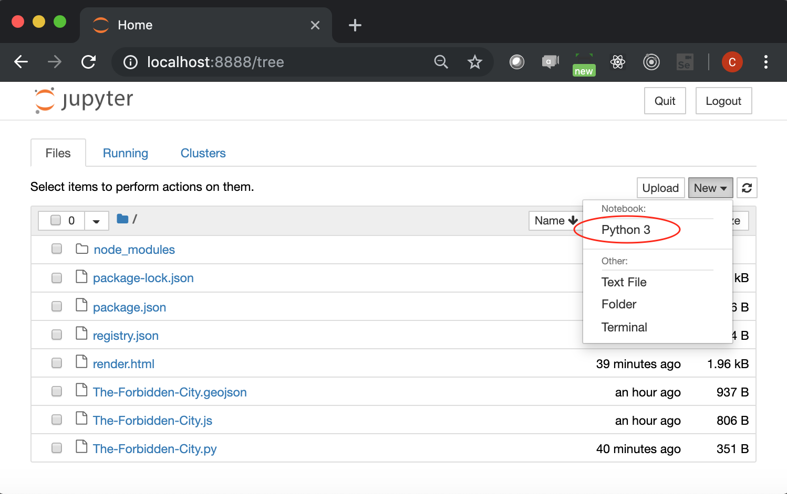
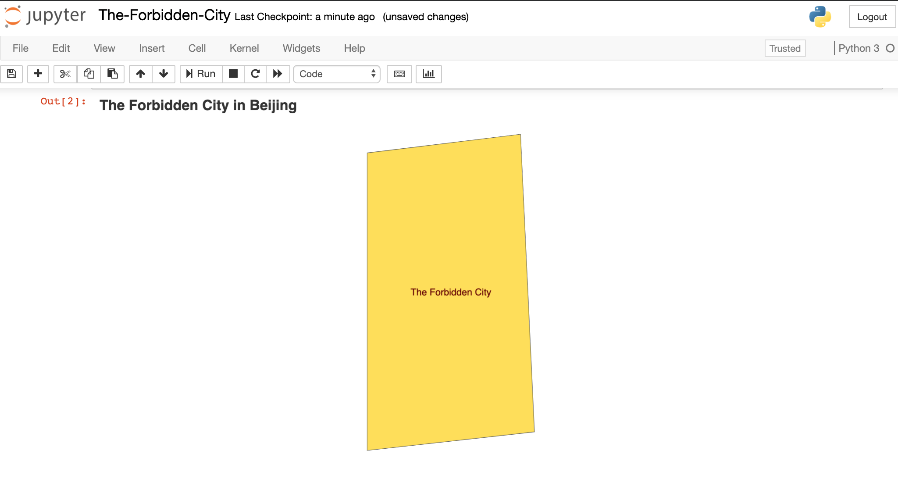

# Get it displayed in jupyter notebook

## Preparation

1. In order to get it displayed in jupyter notebook, you will need to have
the notebook first. If you already have it, for example, you are using
anacornda, you can skip this step.

    ```pip install jupyter-notebook```


1. Of course, you will need to install `pyecharts`

    ```pip install pyecharts>=1.2.0```


1. Launch jupyter-notebook

    ```
    $ jupyter-notebook
    ```

1. Open a new notebook.

    

## Paste the following code and press `Run`:

```

from pyecharts import options as opts
from pyecharts.charts import Geo
from pyecharts.datasets import register_url

register_url("http://127.0.0.1:8000")

g = (
       Geo()
        .add_schema(maptype="The Forbidden City")
        .set_global_opts(
            title_opts=opts.TitleOpts(title="The Forbidden City in Beijing"),
        )
)
g.render_notebook()

```

## Here is what you will get:

