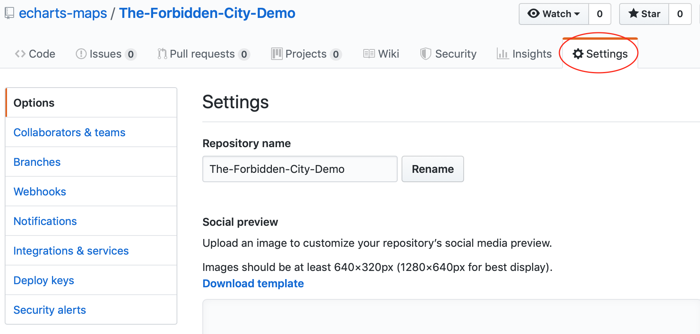
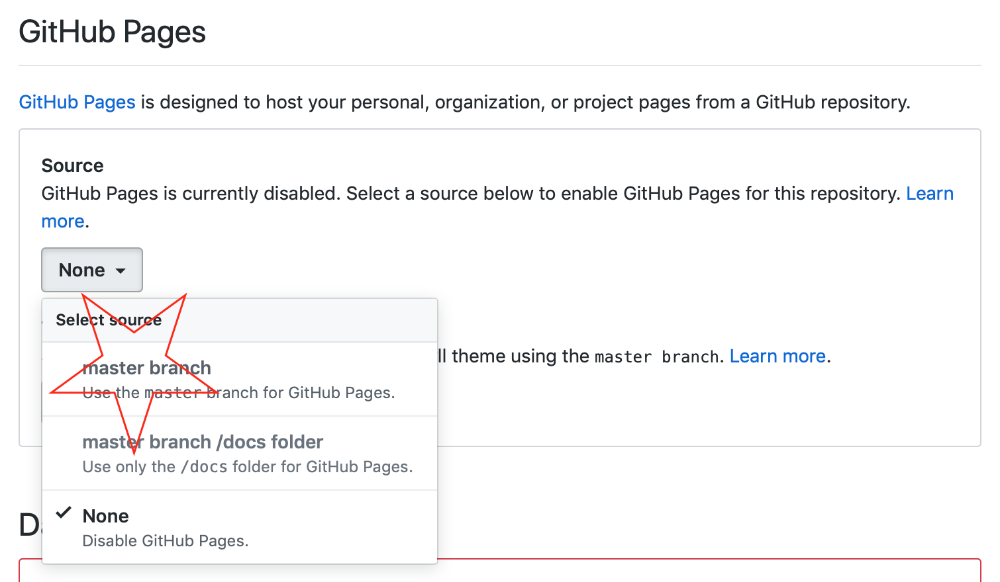
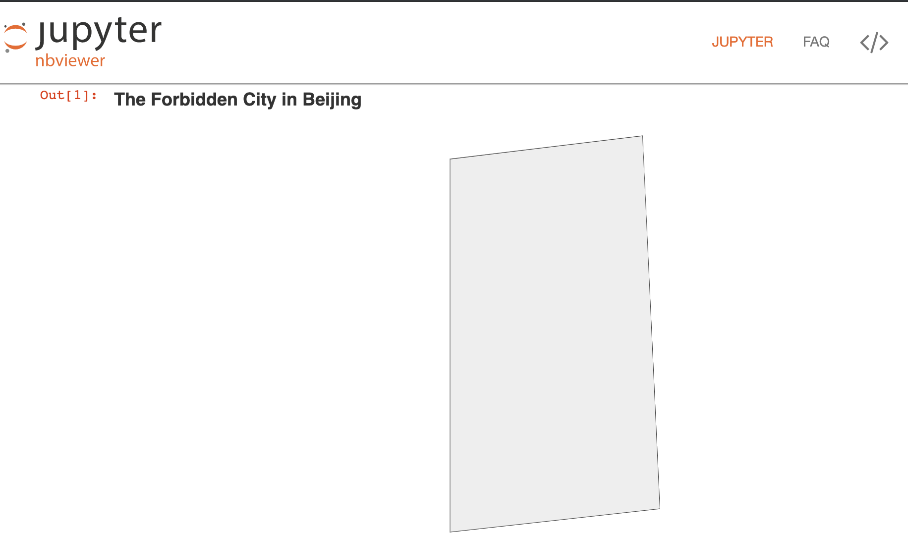

# Sharing it

So we have integrated it with pyecharts and jupyter notebook. When we
sharing it, we cannot use localhost/127.0.0.1. The solution is
to find a static file host.

## Host the js file on github

This is by default how all js assets of echarts-maps are hosted. It is very
handy for me. 

1. Initialize the repo locally.

    ```$ git init```
   
    ```$ git add .```
   
    ```$ git commit -am "initial comment"```

1. Create a project on github and push your local repo up there.
1. Open the `setting` page of your project

    

1. Then scroll down and set up github pages.

    


1. Please wait for github pages to be available.


### Update registry.json

Since we have now published the js file, registry.json needs to be updated as:

```
{
    "GITHUB_URL": "https://echarts-maps.github.io/The-Forbidden-City-Demo",
    "JS_FOLDER": "/",
    "PINYIN_MAP": {
         "The Forbidden City": "The-Forbidden-City"
    },
    "FILE_MAP": {
         "The-Forbidden-City": "The-Forbidden-City"
    }
}
```

And your python file can then use the github site url in rendering:

```python
from pyecharts import options as opts
from pyecharts.charts import Geo
from pyecharts.datasets import register_url

register_url("https://echarts-maps.github.io/The-Forbidden-City-Demo")

g = (
       Geo()
        .add_schema(maptype="The Forbidden City")
        .set_global_opts(
            title_opts=opts.TitleOpts(title="The Forbidden City in Beijing"),
        )
)
g.render()
```

### Now you can share your script

1. You can host `render.html` in your github repo, like this: [https://echarts-maps.github.io/The-Forbidden-City-Demo/render.html](https://echarts-maps.github.io/The-Forbidden-City-Demo/render.html)
2. And share jupyter-notebook via [https://nbviewer.jupyter.org](https://nbviewer.jupyter.org). Here is [the example link](https://nbviewer.jupyter.org/github/echarts-maps/The-Forbidden-City-Demo/blob/master/The-Forbidden-City.ipynb).

    

1. Here is what it can be seen by your audience:

    


Please note that it will take some time for the online jupyter notebook viewer to show properly. For my example, it took 24 hours.


## Other ways to host it publicly

There are many viable solutions:

1. Publish your js file as npm package and use [unpkg.com](http://unpkg.com) as
content delivery server for you.
1. Save it in AWS S3 and make it suing AWS cloud-front
1. Publish your project to google firebase platform.
